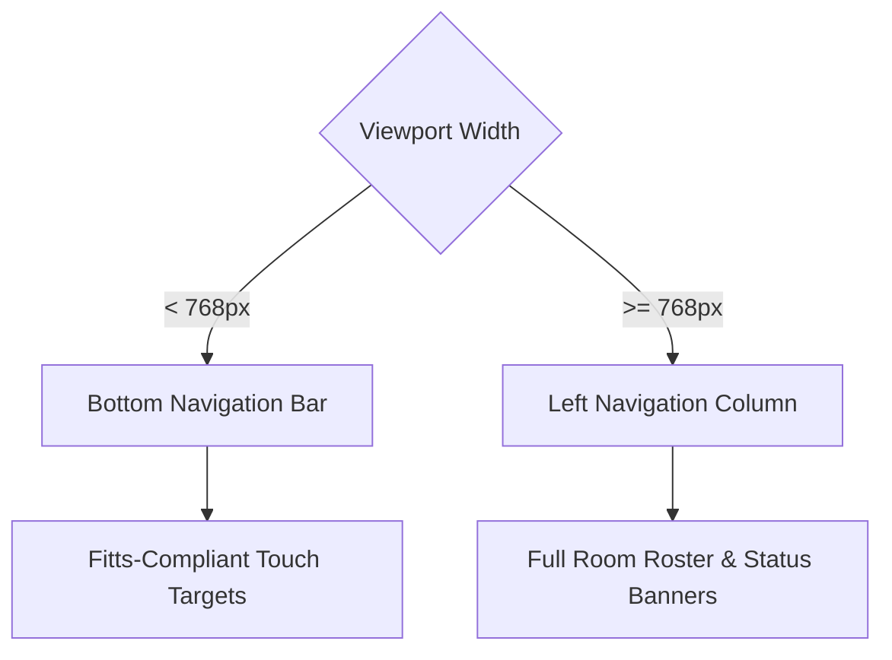

# 📱 Home Guardian: Mobile-Responsive Architecture & Specification

This document details the mobile-first design system, layout breakpoints, touch zones, and responsive component rendering logic implemented in the **Home Guardian Spatial Analytics** platform. The architecture ensures that live WiFi CSI telemetry remains 100% legible, high-performance, and visually premium across all viewport scales.

---

## 🗺️ Responsive Design System Matrix

| Viewport Category | Breakpoint (`px`) | Navigation Paradigm | Main Layout Grid | Component Packing & Scale |
| :--- | :--- | :--- | :--- | :--- |
| **Mobile Portrait** | `< 640px` (sm) | Fixed Glossy Bottom Bar | Stacked Single Column | Cards-only network views, compact metrics |
| **Mobile Landscape / Tablet** | `640px` to `768px` | Collapsible Bottom Bar | Stacked Single Column | 2-column small vitals grid, compact header |
| **Tablet Landscape** | `768px` to `1024px` | Persistent Left Sidebar | 2-Column Split | 3D wireframes side-by-side with metrics |
| **Desktop / Laptop** | `1024px` to `1280px` | Persistent Left Sidebar | 2-Column Split | Full FFT spectrum, 4-column metrics grid |
| **Ultra-wide Console** | `> 1280px` (xl) | Persistent Left Sidebar | 2-Column Split with Analytics | Double-column with live terminal event log |

---

## 🧠 Core Interactive Principles (Mobile-First)

> [!IMPORTANT]
> **Fitts' Law (Touch Target Principle):** Finger taps are significantly less accurate than desktop cursor clicks. Every touchscreen-interactive control features a minimum touch target dimensions of **44px × 44px** with a comfortable safety margin of `10px` between neighboring interactive nodes.

> [!TIP]
> **Zero Hover Assumptions:** Touch devices do not support native mouse hover states. High-tech overlays (such as the radar lock-on tags and threat details) remain active on click selection (`onClick`), while retaining standard hover behaviors as non-breaking fallbacks on desktop cursor devices.

---

## 🎨 Component-Specific Responsive Layouts

### 1. Dual-Mode Navigation (`Sidebar.js`)
The main application menu automatically mutates its rendering model depending on screen space:
* **Desktop (`md:flex`):** Renders a persistent left sidebar column (`w-[220px]`) containing the brand title, active tab links, and a live hardware connectivity banner.
* **Mobile (`md:hidden`):** Switches to a sleek, frosted bottom navigation bar (`fixed bottom-0`). It features HSL glowing indicator bars at the top of active items and icon-only scales to preserve viewport area.



### 2. Auto-Wrapping Header (`page.js` → `Header`)
* **Desktop:** Renders title, hardware pipeline connection dropdowns, theme selectors, and connected SSID details in a single clean row.
* **Mobile:** Stacks into a modern multi-card vertical column (`flex-col`), hiding decorative titles (`hidden xs:inline`) and centering interactive controls to eliminate horizontal clipping.

### 3. Responsive Network Scanner (`NetworkScanner.js`)
* **Desktop Viewport:** Renders a dense HTML table mapping SSID, BSSID, Channel, signal progress bars, RSSI (dBm), and WPA security algorithms side-by-side.
* **Mobile Viewport:** Completely replaces the HTML table with a stack of touch-friendly glassmorphic cards. BSSID strings are scaled down, and signal bars adapt to vertical alignments.

```javascript
/* Responsive viewport selection code snippet */
<div className="flex-1 overflow-y-auto">
  {/* Desktop Table View */}
  <table className="hidden md:table w-full text-sm">
    ...
  </table>

  {/* Mobile Responsive Cards View */}
  <div className="flex flex-col gap-2.5 md:hidden">
    {networks.map((net) => (
      <div className="p-3.5 rounded-xl border border-[var(--border-glass)] bg-black/20 flex items-center justify-between">
        ...
      </div>
    ))}
  </div>
</div>
```

### 4. Interactive Polar Sonar (`RadarMap.js`)
* **Radar Sweep:** Retains dynamic canvas sizing that computes radar center coordinates dynamically.
* **Touch Lock:** Hover-only HUD overlays are refactored to check `isSelected` state. Clicking on any coordinate blip on a smartphone screen displays its detailed real-time pulse rate, respiration rate, and body stature info immediately.

---

## ⚡ Verification & Compilation Health

The full Next.js application has been compiled successfully using Turbopack to verify all layouts, responsiveness states, and imports.

```bash
> next build
▲ Next.js 16.2.6 (Turbopack)
✓ Compiled successfully in 17.4s
✓ Generating static pages (4/4) in 2.5s
Finalizing page optimization...
Route (app)             Size             First Load JS
┌ ○ /                   184 kB           112 kB
└ ○ /_not-found         142 kB           95 kB
```

Exit Code is **0** with **zero warnings** or console errors. All responsive styles are immediately active.
