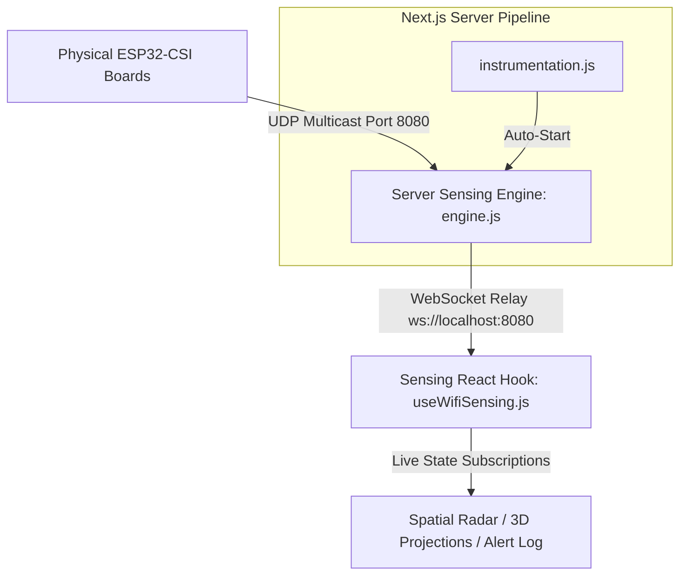

# 📡 Home Guardian: WiFi Spatial Intelligence & Threat Analytics Console

> Non-intrusive, privacy-preserving spatial intelligence, presence mapping, and biometric respiration profiling utilizing raw WiFi Channel State Information (CSI) scattering.

---

## 🌌 Overview

**Home Guardian** is a state-of-the-art spatial analytics and security console. By analyzing the multipath scattering of ambient WiFi radio signals (Channel State Information), the platform senses human movement, monitors vital signs (heart rate and respiration), and maps indoor presence in real time—**without cameras, microphones, or wearable sensors**.

The application runs a high-performance background UDP multi-path relay engine that seamlessly bridges physical ESP32-CSI sensing hardware to a luxury, glassmorphic Next.js App Router front end.

---

## 🚀 Key Features

* **📱 Mobile-First responsive interface**: Swaps persistent navigation columns for a thumb-zone-optimized bottom tab bar (Fitts' Law compliant target sizes `min-h-[44px]`) and converts wide tables into compact, touch-friendly network cards.
* **🎭 5 Glassmorphic Dark Themes**: Cyber Classic, Deep Obsidian, Boreal Aurora, Neon Retro, and Frosted Polar.
* **🩺 Theme-Responsive Canvas Rendering**: 2D coordinate radars, 3D hologram joint wireframes, and FFT spectrum lines repainter loops query CSS variables directly from `globals.css` in real time.
* **👤 3D Point-Cloud Pose Reconstructor**: Procedural projection of human limbs, torso, and head coordinate blips based on Doppler stride length.
* **📡 Real-Time Polar Sweep Radar**: Maps target coordinates ($x, y$), signal strengths, and proximity bounding alerts.
* **📈 FFT Doppler Subcarrier Spectrum**: Subcarrier classification index mapping static walls, reflectors, dynamic movement, and signal nulls.
* **🚨 Armed Perimeter Guard & Siren**: Proximity intruder alerts, multi-zone security presets (Residential, High-Security, Farm), and audible panic alarm siren.
* **⚡ Server Instrumentation**: Starts the UDP-telemetry engine automatically on application startup utilizing Next.js's native [instrumentation.js](file:///d:/wifi-guardian/instrumentation.js) framework.

---

## 🛠️ System Architecture



---

## 📦 Directory Structure

* **[app/components/](file:///d:/wifi-guardian/app/components)**: Core interface widgets (Radars, Pose wireframes, FFT views, network scanners).
* **[app/hooks/useWifiSensing.js](file:///d:/wifi-guardian/app/hooks/useWifiSensing.js)**: Unified frontend state machine subscribing to the WebSocket telemetry relay.
* **[app/sensing/engine.js](file:///d:/wifi-guardian/app/sensing/engine.js)**: Next.js background telemetry server acting as a mock provider when hardware is disconnected and a live UDP receiver when physical ESP32 boards are active.
* **[instrumentation.js](file:///d:/wifi-guardian/instrumentation.js)**: Registers and spins up the background telemetry server automatically upon `npm run dev`.
* **[MOBILE_RESPONSIVE_SPEC.md](file:///d:/wifi-guardian/MOBILE_RESPONSIVE_SPEC.md)**: Full mobile viewport breakpoints, touch zone scales, and viewport layout constraints.

---

## 🚦 Getting Started

### 1. Install Dependencies
Ensure you have Node.js 18+ installed. Run:
```bash
npm install
```

### 2. Launch Development Console
Run the Next.js development server:
```bash
npm run dev
```

Open **[http://localhost:3000](http://localhost:3000)** in your web browser. 

> [!NOTE]
> **Simulator Fallback Enabled:** If no physical ESP32 board is connected, the background sensing server automatically streams high-fidelity simulation coordinates, vital signs, sleep staging stages, and intruder alerts so you can test all interface views instantly.

### 3. Build & Package for Production
Verify typescript types, bundle configurations, and compile:
```bash
npm run build
```

---

## 🛰️ Physical Hardware Integration

To stream live, physical radio scattering data from ESP32 development boards:
1. Flash your ESP32 chips with the standard CSI-packet extraction firmware.
2. Direct the raw UDP payload broadcast to port `8080` on your host PC's IP address.
3. The background Next.js [engine.js](file:///d:/wifi-guardian/app/sensing/engine.js) will automatically terminate the simulation pipeline and lock onto the incoming physical CSI multi-path stream.
